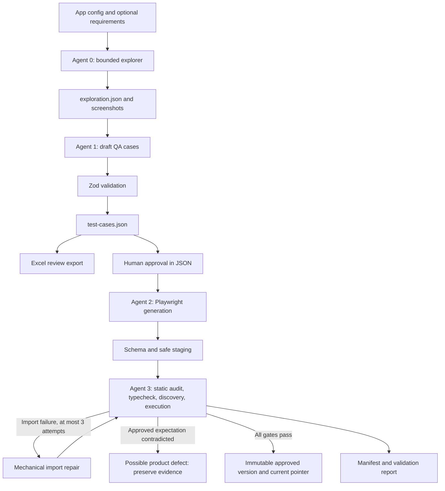

# Multi-Agentic AI QA Automation Framework

A TypeScript QA pipeline that turns observed application evidence and reviewed test cases into validated Playwright automation. It includes two model-backed generation stages and deterministic exploration, validation, repair, and promotion stages.

## Implementation status

| Status       | Capabilities                                                                                                                                                                                                                        |
| ------------ | ----------------------------------------------------------------------------------------------------------------------------------------------------------------------------------------------------------------------------------- |
| IMPLEMENTED  | Zod contracts; bounded browser evidence; canonical JSON and Excel export; approval filtering; safe staging; generated compilation, discovery and execution; immutable promotion; manifests; fixture mode; app-specific projects; CI |
| EXPERIMENTAL | Live model generation; heuristic failure classification; automatic import-path repair; legacy generated SauceDemo scenarios                                                                                                         |
| PLANNED      | Reviewed semantic/selector repairs; authenticated exploration actions; distributed scheduling; sharding; comprehensive multi-browser and accessibility coverage                                                                     |

The committed generated login baseline and five curated SauceDemo tests are acceptance checks. The larger legacy generated suite compiles and is discoverable, but is not an approved behavioral baseline.

## Architecture



## Agent responsibilities

- **Agent 0:** visits the base URL and configured routes, collecting titles, visible headings, controls, approximate accessible names, selector evidence IDs, and screenshots.
- **Agent 1:** consumes evidence and optional requirements, creates schema-validated cases, forces draft status, and checks selector provenance.
- **Agent 2:** reads canonical JSON and generates specs/page objects for approved, automation-feasible cases.
- **Agent 3:** classifies gate failures and performs bounded mechanical import repair. Assertion failures remain defect candidates.
- **Orchestrator:** creates a run, connects the stages, records hashes/counts/usage, validates output, and promotes eligible passing artifacts.

## Local setup

Use Node.js 22 or newer. Run from the repository root.

```bash
npm ci
npx playwright install chromium
npm run typecheck
npm run test:framework
npm run test:saucedemo
npm run validate:generated
npm run test:generated:fixture
npm run pipeline:saucedemo:no-ai
```

Framework tests use mocked outputs and a local HTTP fixture; Chromium is required. Browser acceptance tests and the no-AI pipeline contact the public demo applications. No-AI means no paid model calls, not offline browsing.

## OpenAI API setup

Copy `.env.example` to `.env`, set `OPENAI_API_KEY`, and optionally set `OPENAI_MODEL`. Keep the key local or in GitHub Actions secrets. The API client is constructed only when generation is requested. Fixture and unit tests do not require a key.

Live generation uses the Responses API with bounded output, timeout/retries, and local Zod validation. Model access depends on your account. No live API generation is required by ordinary CI.

## Human approval and canonical data

Agent 1 writes `test-cases.json` and an Excel export containing a **Review Status** column. JSON is the machine contract. Excel is a review view; editing it does not update JSON.

Review scenario, steps, expected result, evidence, and provenance in JSON, then change selected cases from `draft` to `approved`. Agent 2 selects only `automationFeasible: true` and `reviewStatus: "approved"`. Rejected cases are never selected.

`--demo-approve-drafts` allows draft generation for experiments and records this override. Draft output is not promoted. Fixture mode uses committed reviewed baseline cases.

## SauceDemo example

Generate cases for review:

```bash
npm run pipeline:saucedemo -- --generate-cases-only
```

The command prints the run directory. Review its JSON, then generate and validate:

```bash
npm run pipeline:saucedemo -- --cases generated/runs/REPLACE_WITH_RUN_ID/test-cases.json --exploration generated/runs/REPLACE_WITH_RUN_ID/exploration.json
```

Keep the original sibling screenshots directory. If case generation used `--requirements FILE`, supply the same file with `--requirements FILE` when resuming; its contents are fingerprinted too.

For a complete repeatable demo using committed model-output fixtures:

```bash
npm run pipeline:saucedemo:no-ai
```

The baseline verifies successful login, the inventory URL, visible inventory, and the Products title.

## Commands

| Command                                                | Purpose                                               |
| ------------------------------------------------------ | ----------------------------------------------------- |
| `npm run typecheck`                                    | Framework and curated TypeScript                      |
| `npm run test:framework`                               | Deterministic framework tests                         |
| `npm run test:saucedemo`                               | Five curated SauceDemo tests                          |
| `npm run test:uitestingplayground`                     | Curated Playground project; currently empty           |
| `npm run typecheck:generated`                          | Committed generated fixtures and legacy artifacts     |
| `npm run test:generated:list`                          | Generated discovery                                   |
| `npm run test:generated:fixture`                       | Known-good SauceDemo login                            |
| `npm run test:generated`                               | Generated fixture and experimental legacy suite       |
| `npm run validate:generated`                           | Generated compilation and discovery                   |
| `npm run agent:explore -- RUN_DIRECTORY`               | Standalone bounded exploration                        |
| `npm run agent:generate-testcases -- EXPLORATION_JSON` | Generate draft JSON and Excel beside evidence         |
| `npm run agent:generate-scripts -- CASES_JSON`         | Generate validated automation JSON for review         |
| `npm run agent:validate-repair -- STAGING_DIRECTORY`   | Standalone validation and import repair, no promotion |
| `npm run pipeline:uitestingplayground -- --no-ai`      | Playground text-input baseline pipeline               |

Orchestrator flags: `--explore-only`, `--generate-cases-only`, `--generate-code-only --cases FILE`, `--validate-only --cases FILE --code-dir DIR`, `--no-ai`, `--max-repairs 0..3`, `--requirements FILE`, `--exploration FILE`, and `--demo-approve-drafts`. Select at most one partial mode. Code-generation mode skips case generation but still validates the generated code. Validate-only copies supplied code into a new run before validation.

## Quality gates and repair

Each candidate must pass schema validation, static contract checks, TypeScript compilation, Playwright discovery, and execution. Zero tests and skipped/non-passing results fail validation.

Repair attempts live in separate directories. The implemented repair changes only import module strings pointing to known generated page objects. It cannot edit test bodies, remove assertions, skip tests, or alter approved expectations. Unsupported failures stop with diagnostics; three is a ceiling, not a requirement to retry an unrepairable failure.

Execution assertion mismatches are classified as `POSSIBLE_PRODUCT_DEFECT`, not proof of an application defect. A reviewer must distinguish a genuine defect from an incorrect generated assertion.

## Runs and promotion

```text
generated/runs/<run-id>/
  manifest.json
  exploration.json
  test-cases.json
  test-cases.xlsx
  staging/{specs,page-objects}/
  validation-report.json
  screenshots/
  reports/attempt-0/{discovery,execution}/
  repair/attempt-1/
generated/approved/<app>/
  <run-id>/{specs,page-objects}/
  current.json
```

Failure traces/screenshots are under each attempt's execution report directory. Runtime output is ignored by Git. Promotion creates a new version and atomically updates a pointer; it never overwrites an existing code version. Code hashes must match the validated batch.

Example manifest excerpt (full schema: `shared/schemas/run-manifest.schema.ts`):

```json
{
  "runId": "saucedemo-example",
  "application": "saucedemo",
  "model": "fixture",
  "promptVersions": {
    "testcase-creator": "<sha256>",
    "script-generator": "<sha256>"
  },
  "inputHashes": {
    "appConfig": "<sha256>",
    "exploration": "<sha256>",
    "testCases": "<sha256>"
  },
  "counts": {
    "generatedTests": 1,
    "approvedTests": 1,
    "automationReady": 1,
    "specs": 1,
    "pageObjects": 1
  }
}
```

Example validation-report excerpt:

```json
{
  "runId": "saucedemo-example",
  "typecheck": { "status": "passed", "diagnostics": "", "durationMs": 700 },
  "discovery": {
    "status": "passed",
    "diagnostics": "1 test",
    "durationMs": 500
  },
  "execution": {
    "status": "passed",
    "diagnostics": "1 passed",
    "durationMs": 1500
  },
  "repairAttempts": 0,
  "defectCandidates": [],
  "finalResult": "passed",
  "artifactHash": "<sha256>"
}
```

Full reports also track schema and initial typecheck results. Manifests include timestamps, artifact paths, and optional token usage.

## Application isolation and Playground roadmap

Each curated Playwright project owns its test directory and base URL. Certified generated tests additionally use a browser/API origin guard with explicit configured origins, exact bracketed case IDs, and per-test static plus runtime assertion checks. `TARGET_APP` selects standalone agent configuration; it cannot redirect all curated tests to one URL.

Playground has bounded routes for Dynamic ID and Text Input plus a generated text-input baseline. Planned scenarios: Class Attribute, Hidden Layers, Load Delay, AJAX Data, Client Side Delay, Click, Scrollbars, Alerts, and broader Dynamic ID coverage.

## CI behavior

PR/push CI installs Chromium, runs framework checks, curated SauceDemo tests, generated compilation/discovery, the login fixture, and the no-AI pipeline. Reports are uploaded even on failure. No OpenAI secret is required.

The manual **Manual agentic pipeline** workflow offers no-AI, draft-case generation, and generation from a reviewed repository JSON file. Paid modes use the `OPENAI_API_KEY` GitHub secret. Generated drafts never silently become approved in that workflow. The artifact includes both run evidence and promoted immutable versions with current.json.

## Limitations

- Static source checks and a restricted child environment are not an operating-system security sandbox. Run untrusted model code on disposable workers; adversarial-code isolation is future work.
- Schema validation cannot prove that a generated test faithfully implements business intent. Human review remains necessary.
- Accessible names/roles are best-effort DOM observations, not a complete accessibility-tree implementation. Screenshots may contain application data.
- Exploration follows configured routes only; it does not log in, click arbitrary controls, or execute destructive actions.
- Live model quality and broader legacy test behavior are experimental. Legacy cases include unreviewed expectations; compilation is not behavioral approval.
- Execution depends on demo-site availability. Paid generation was not used to verify the implementation.
- Repair is intentionally limited to import paths. Selector, semantic, and method-body repairs require a stronger review mechanism.
- A single run is bounded; distributed execution and batching are planned.

## Documentation and next milestones

See [architecture](docs/architecture.md), [agent design](docs/agent-design.md), [data contracts](docs/data-contracts.md), [quality gates](docs/generated-code-quality-gates.md), [repair loop](docs/execution-and-repair-loop.md), [adding an application](docs/adding-a-new-application.md), and [roadmap](docs/roadmap.md).
